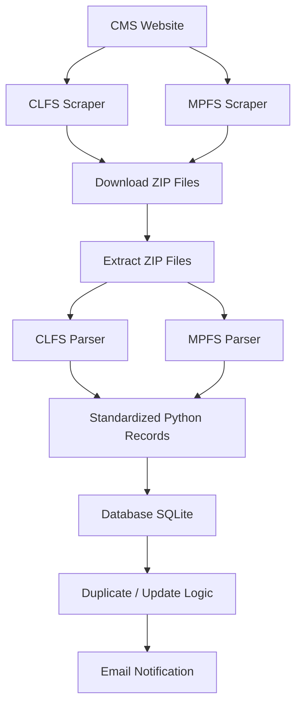
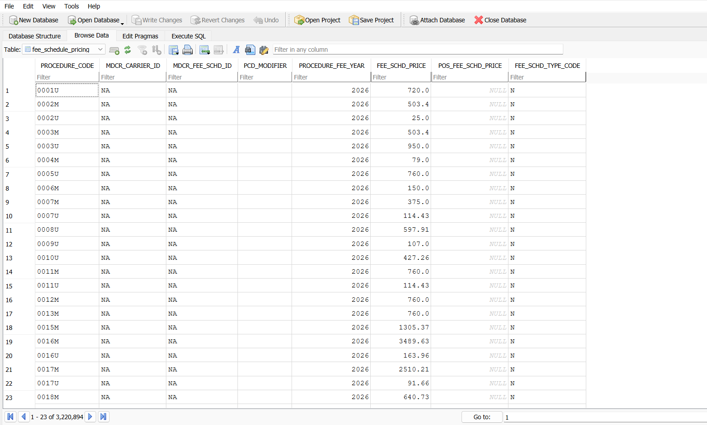
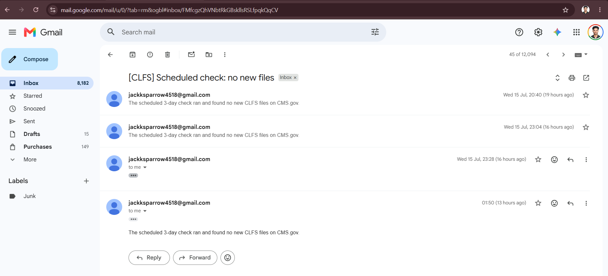

# CMS Fee Schedule Automation

Downloads CMS's Clinical Laboratory Fee Schedule (CLFS) and Physician Fee
Schedule (MPFS) files, loads the pricing data into one local database, and
emails a summary when something's new or changed.

---

## Setup

```bash
python -m venv venv
source venv/bin/activate        # Windows: venv\Scripts\activate
pip install -r requirements.txt

cp .env.example .env             # fill in your Gmail app password
```

---

## Commands (`main.py`)

| Command | What it does |
|---|---|
| `python main.py list` | Shows every CLFS file currently available on CMS.gov |
| `python main.py list --source mpfs` | Shows every MPFS file currently available on CMS.gov |
| `python main.py sync <file_code>` | Downloads, parses, and stores one specific CLFS file (e.g. `25CLABQ1`) |
| `python main.py sync <file_code> --source mpfs` | Same as above, for one specific MPFS file (e.g. `PFREV26C`) |
| `python main.py check` | Checks CMS.gov for anything new in **both** CLFS and MPFS, and processes it |
| `python main.py schedule` | Runs `check` automatically on a repeating timer |
| `python main.py report` | Prints a summary of what's currently in the database |

---

## Folders & files

| Folder / File | What it does |
|---|---|
| `main.py` | The entry point — reads your command and runs the right thing |
| `config/` | Settings only, no logic: CMS URLs, email settings, and the column-name mappings used to read CLFS/MPFS files |
| `scraper/` | Talks to CMS.gov — finds available files and downloads them (one module for CLFS, one for MPFS) |
| `parser/` | Reads the downloaded files and turns them into clean, structured rows |
| `db/` | All database reads/writes — saving pricing data, checking for duplicates |
| `pipeline/` | The conductor — runs scraper → parser → database → email in the right order, and the auto-repeat scheduler |
| `notifier/` | Sends the summary/error emails |
| `tests/` | Automated checks that simulate the pipeline to make sure everything still works |
| `clfs.db` | The database file itself — where all the pricing data lives |

---

## Overall Architecture



---

## Composite keys

A composite key is the combination of columns used to decide "have I
already seen this row, so I should update it — or is it brand new?"

**CLFS**
```
procedure_code + modifier + year
```
CLFS prices are national — there's no carrier or location involved — so
code + modifier + year is enough to uniquely identify a row.

**MPFS**
```
procedure_code + modifier + year + carrier + locality
```
MPFS prices vary by carrier and locality — the same code can have a
different price in every location — so both fields have to be part of the
key, or one locality's price would overwrite another's.

Since both file types share one table, CLFS rows use the placeholder
`'NA'` for carrier/locality (they simply don't have that data), while MPFS
rows carry the real values — so the two sources never collide.

---

## `fee_schedule_pricing` table structure

| Column | Description |
|---|---|
| `PROCEDURE_CODE` | HCPCS procedure code |
| `MDCR_CARRIER_ID` | Carrier number (MPFS) / `'NA'` (CLFS) |
| `MDCR_FEE_SCHD_ID` | Locality (MPFS) / `'NA'` (CLFS) |
| `PCD_MODIFIER` | Procedure modifier |
| `PROCEDURE_FEE_YEAR` | Calendar year the price applies to |
| `FEE_SCHD_PRICE` | Price (CLFS) / Non-Facility price (MPFS) |
| `POS_FEE_SCHD_PRICE` | Facility price (MPFS only, `NULL` for CLFS) |
| `FEE_SCHD_TYPE_CODE` | Indicator (CLFS) / Status code (MPFS) |

---

## Rows currently in the database

These counts will keep increasing as new CLFS/MPFS files are added over time.

| | Row count |
|---|---|
| **Total rows** in `fee_schedule_pricing` | 3,220,894 |
| CLFS rows | 736,987 |
| MPFS rows | 2,483,907 |

---

## Technologies used

- **Python** — core language for the entire pipeline
- **Requests** / **BeautifulSoup** — scraping CMS.gov (listing pages, file downloads, HTML parsing)
- **SQLite** — the local database (`fee_schedule_pricing`, `processed_files`, `change_log`)
- **smtplib (Gmail SMTP)** — sending email notifications
- **schedule** — the repeating-timer scheduler for `python main.py schedule`
- **Mermaid** — architecture diagram in this README

---

## Screenshots

### Database photo


### Email notification

